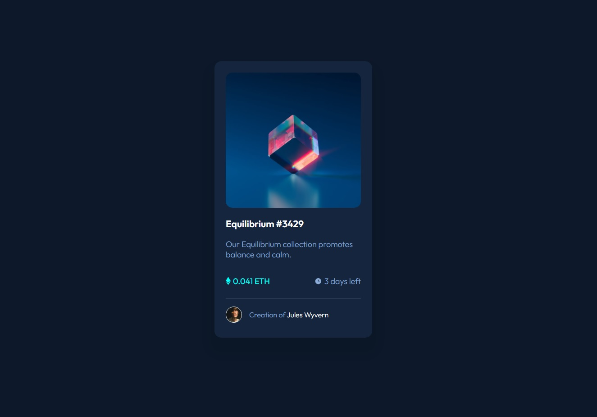

# Frontend Mentor - NFT preview card component solution

This is a solution to the [NFT preview card component challenge on Frontend Mentor](https://www.frontendmentor.io/challenges/nft-preview-card-component-SbdUL_w0U). 

## Table of contents

  - [The challenge](#the-challenge)
  - [Screenshot](#screenshot)
  - [Links](#links)
  - [Built with](#built-with)
  - [What I learned](#what-i-learned)
  - [Useful resources](#useful-resources)
- [Acknowledgments](#acknowledgments)


### The challenge

Users should be able to:

- View the optimal layout depending on their device's screen size
- See hover states for interactive elements

### Screenshot




### Links

- [Solution URL](https://github.com/Elvis-LR/NFT-preview-card-component)
- [Live Site URL](https://elvis-lr.github.io/NFT-preview-card-component/)

### Built with

- Semantic HTML5 markup
- CSS custom properties
- Flexbox

### What I learned


```html
      <div class="seller">
        
        <p>Creation of <span>Jules Wyvern</span></p>
      </div>
```
```css
.card .mainitem div img{
    position:absolute;
    left: 50%;
    top: 50%;
    transform: translate(-50%, -50%);
}
.card{
    display: flex;
    flex-direction: column;
    width: 350px;
    margin: 1.5625rem 3.125rem 4.6875rem;
    padding: 1.5625rem;
    border-radius: 15px;
    background-color: hsl(216, 50%, 16%);
    box-shadow: 0px 24px 16px 14px rgba(0,0,0,0.1);
}
```


### Useful resources

- [Flexbox](hhttps://css-tricks.com/snippets/css/a-guide-to-flexbox/) - This really helped me a lot with the layout


## Acknowledgments

Spent some time watching how youtube/tsbsankara did this challenge help me on some tricky parts like the hover image.
